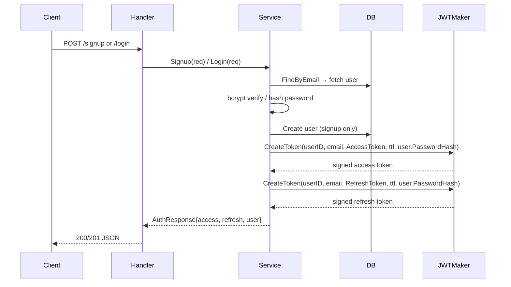
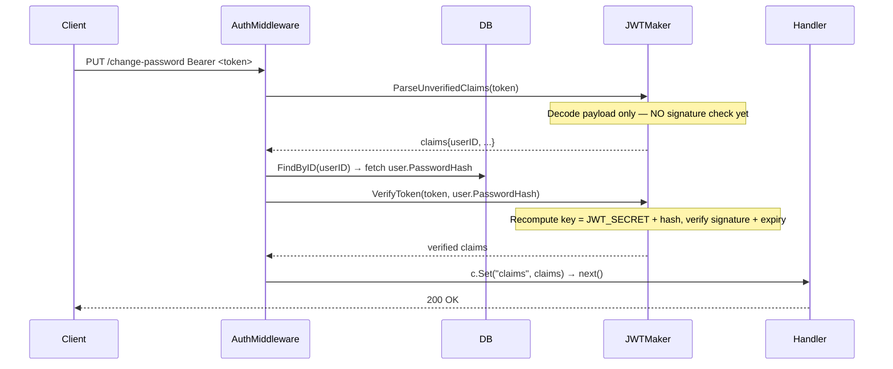
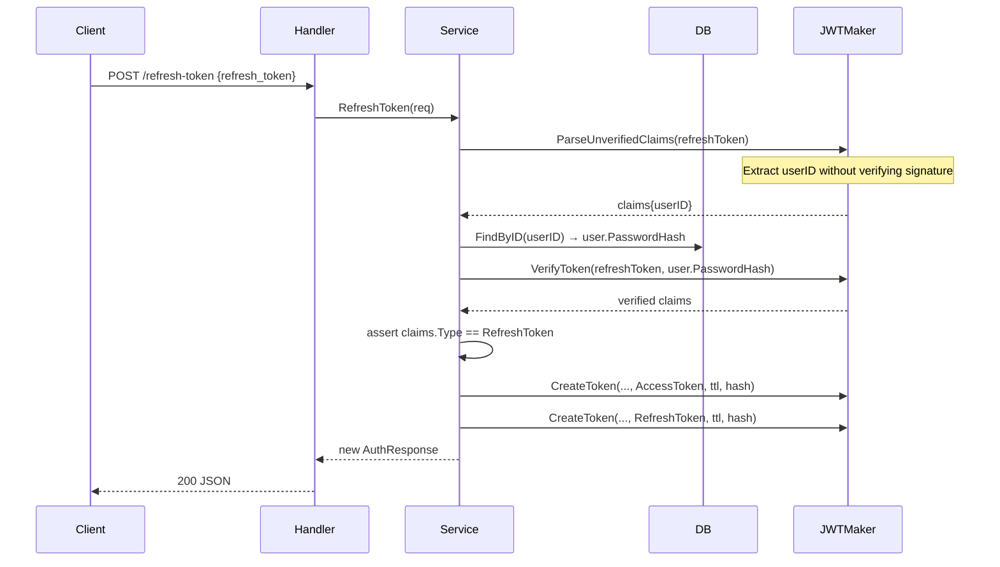
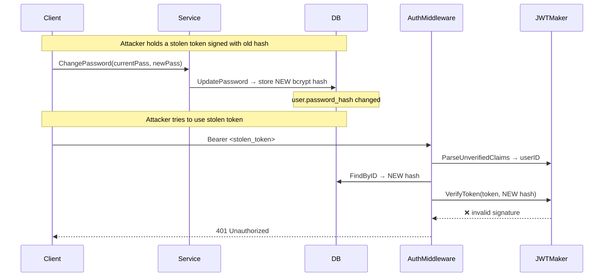

# JWT Flow

Signing key = `JWT_SECRET + user.password_hash`  
Changing password changes the hash → all outstanding tokens become invalid instantly, no blocklist needed.

---

## Token Creation (Signup / Login)

**Signing key per call:** `HMAC-SHA256(JWT_SECRET + passwordHash)`

---

## Authenticated Request (change-password)

---

## Refresh Token

---

## Password Change → Token Invalidation

---

## Key Derivation Summary

| Step | Value |
|---|---|
| Base secret | `JWT_SECRET` (env var, never changes) |
| Per-user salt | `user.password_hash` (bcrypt, changes on password update) |
| Signing key | `JWT_SECRET + password_hash` (concatenated, used as HMAC-SHA256 key) |
| Token invalidated when | user changes password → hash changes → old signature invalid |

---

## Files

| File | Role |
|---|---|
| `app/shared/token/jwt.go` | `Maker` interface — `CreateToken`, `VerifyToken`, `ParseUnverifiedClaims` |
| `app/infra/middleware/auth.go` | Two-step verify: parse unverified → DB lookup → verify with hash |
| `app/features/users/service.go` | `buildAuthResponse` signs with hash; `RefreshToken` two-step verify |
| `cmd/main.go` | Wires `hashFn` closure over `usersRepo.FindByID` |
